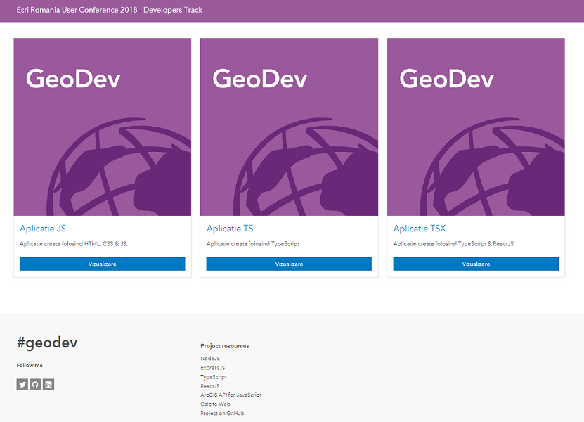

<!-- .slide: data-background="./images/title.png" -->

UC 2018

##  ArcGIS API for JavaScript

<br>

### Realizarea de aplicații WebGIS folosind tehnologii și framework-uri moderne

---

<!-- .slide: data-background="./images/section.png" -->

<br>
<br>
<br>
Vă informăm că pe durata desfășurării evenimentului “Conferința Utilizatorilor Esri, Trimble și Harris-Exelis” din data de 28.09.2018, în calitate de operator, organizatorul Esri România poate prelucra date cu caracter personal precum imaginea, fotografia, numele, prenumele, functia, compania, adresa de e-mail. Participarea la eveniment implică acordul dumneavoastră.  Prelucrarea suplimentară, pe cont propriu a participanților la eveniment, necesită acordul prealabil al organizatorului.

---

<!-- .slide: data-background="./images/section.png" -->
## Prezentatori

<br>

### Ionuț Alixăndroae - [@ialixandroae](https://twitter.com/ialixandroae)

---

## Agendă

<br>

- [ArcGIS API for JavaScript 4.x](https://developers.arcgis.com/javascript/)
-	Utilizare [NodeJS](https://nodejs.org/en/) pentru crearea unui server web 
-	Utilizare [ArcGIS API for JavaScript](https://developers.arcgis.com/javascript/), [TypeScript](https://www.typescriptlang.org/) și [ReactJS](https://reactjs.org/) pentru dezvoltarea de aplicații WebGIS 
-	[Construcția unui API RESTful](https://medium.freecodecamp.org/building-a-simple-node-js-api-in-under-30-minutes-a07ea9e390d2) pentru integrarea back-end și front-end

---

<!-- .slide: data-background="./images/section.png" -->

## Ce obțin folosind versiunea 4.x JSAPI ?

- API simplificat și consistent<!-- .element: class="fragment" data-fragment-index="1" -->

- ES6 sau TypeScript<!-- .element: class="fragment" data-fragment-index="1" -->

- Suport pentru browsere moderne<!-- .element: class="fragment" data-fragment-index="1" -->

- Integrare cu diferite framework-uri moderne<!-- .element: class="fragment" data-fragment-index="1" -->

---
<!-- .slide: data-background="./images/demo.png" -->

## Aplicații 2D

<iframe height='600' width='100%' src='https://ialixandroae.github.io/liveHeatmapRenderer/'></iframe>

---
<!-- .slide: data-background="./images/demo.png" -->

## Aplicații 3D

<iframe height='600' width='100%' src='https://ialixandroae.github.io/letour2018/app.html'></iframe>
</iframe>

---
<!-- .slide: data-background="./images/section.png" -->

## Cele mai noi exemple 

<iframe height='600' width='100%' src='https://developers.arcgis.com/javascript/latest/sample-code/index.html'></iframe>

---
<!-- .slide: data-background="./images/demo.png" -->

## Server Web folosind NodeJS & Express

<br>

```js
const express = require('express');
const app = express();
const port = 3000;

app.listen(port, () => {
    console.log("APP IS RUNNING ON PORT 3000");
});
```

---
<!-- .slide: data-background="./images/demo.png" -->

## Crearea API-ului și rutelor folosind NodeJS & Express

<br>

```js
// API - Root route
app.get('/', (req, res) => {
    console.log('Test');
    res.sendFile(__dirname + '/views/index.html');
});

// API - App1 Route
app.get('/app2/*', (req, res) => {
    res.sendFile(__dirname + '/apps/app2/app2.html');
});

// API - App2 Route

// API - App3 Route

// API - 404 route
app.get('*', (req, res) => {
    res.status(404).send('Page does not exists!');
});
```

---
<!-- .slide: data-background="./images/demo.png" -->

## TypeScript cu ArcGIS JSAPI

```ts
import EsriMap = require("esri/Map");
import MapView = require("esri/views/MapView");

class MyMap {

    container: string;
    basemap: string;

    constructor(container: string, basemap: string = 'hybrid') {
        this.container = container;
        this.basemap = basemap
    };

    createMap() {
        const map = new EsriMap({
            basemap: this.basemap
        });

        const mapView = new MapView({
            map: map,
            container: this.container,
            center: [25, 46],
            zoom: 7
        });
    };
};
```

```ts
const map1 = new MyMap("viewDiv");
map1.createMap(); //hybrid basemap

const map2 = new MyMap("viewDiv", "streets");
map2.createMap(); //streets basemap
```

---
<!-- .slide: data-background="./images/demo.png" -->

## Framework-uri cu ArcGIS JSAPI

Map.tsx

<br>

```ts
import * as React from "react";
import { _MyMap } from "../ts/main";

export default class Map extends React.Component<any, any>{
    render() {
        
        const myMap = new _MyMap(this.props.container);
        myMap.createMap();

        return null;
    }
};
```

---
<!-- .slide: data-background="./images/demo.png" -->

## Framework-uri cu ArcGIS JSAPI

Index.tsx

<br>

```ts
import * as React from 'react';
import * as ReactDOM from 'react-dom';

import Map from './Map';

class App extends React.Component<any, any> {

    constructor(props) {
        super(props);
        this.state = {
            container: String
        };
    };

    componentDidMount() {
        const root: HTMLElement = document.getElementById('root');
        const container: HTMLElement = document.createElement('div');
        container.id = 'viewDiv';
        container.style.height = '100%';

        root.appendChild(container);
        this.setState(() => ({ container: container }))

    };

    render() {
        return (
            <div> 
                <Map container={this.state.container.id}/>
            </div>
        );
    };
}

ReactDOM.render(<App />, document.getElementById('root'));
```

---

<!-- .slide: data-background="./images/section.png" -->


## Pagină principală aplicație 



